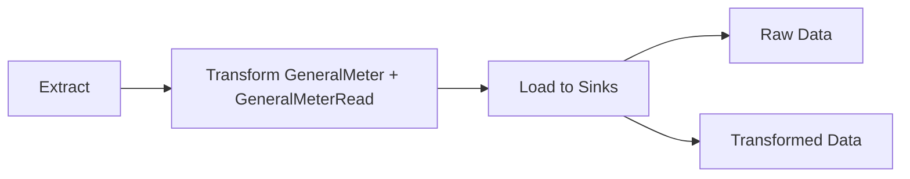

# Operating the AMI Connect Data Pipeline

**AMI Connect** is a Python-based ETL pipeline for ingesting, transforming, and loading Advanced Metering Infrastructure (AMI) data into standardized formats for analysis and storage. It is designed for production use with Airflow but can also be run as a standalone script.  

---

## Overview

AMI Connect follows a **common ETL pattern**:

1. **Extract**  
   - Uses *adapters* to connect to AMI data sources.  
   - Each adapter inherits from the `BaseAMIAdapter` class.

2. **Transform**  
   - Adapters convert extracted source data into a **generalized format**.  
   - This format is defined by two Python dataclasses:
     - `GeneralMeter`
     - `GeneralMeterRead`  

3. **Load**  
   - Data is loaded into one or more *storage sinks*.  
   - Each sink inherits from `BaseAMIStorageSink`.  
   - Currently, **Snowflake** is the only supported sink, but more can be added.  
   - Both **raw data** (from extraction) and **transformed data** are loaded.

---

## Intermediate Outputs

- Extracted and transformed outputs are stored in an implementation of `BaseTaskOutputController`.  
- Supported controllers:
  - **S3** (recommended for production)
  - **Local file system** (useful for development/testing)  

This allows outputs from each stage to be inspected, reused, or (someday!) replayed without re-extracting from the source.

---

## Configuration

Users control the pipeline through configuration files:

- **`config.yaml`** – defines which AMI data sources to run, sinks to load into, and task output controller settings.  
- **`secrets.yaml`** – provides connection credentials and secure parameters.  

Each AMI source defined in configuration becomes its own set of pipeline DAGs in Airflow.

---

## Airflow Integration

While the pipeline can be run directly as a Python script, **AMI Connect is designed for Airflow**.  
For each configured AMI source, the system generates **three Airflow DAGs**:

1. **Standard Daily DAG**  
   - Runs the ETL daily for that source.  

2. **Manual DAG**  
   - Allows on-demand runs for an arbitrary date range.  

3. **Backfill DAGs** (optional)  
   - Created when automated backfills are specified in configuration.  
   - Allow historical data to be ingested systematically.  

---

## Package Structure

All ETL logic lives in the **`amiadapters`** package:  

- **Adapters** – implementations of `BaseAMIAdapter` for each data source.  
- **Models** – dataclasses such as `GeneralMeter` and `GeneralMeterRead`.  
- **Storage Sinks** – implementations of `BaseAMIStorageSink` (e.g., Snowflake).  
- **Outputs** – implementations of `BaseTaskOutputController` (e.g., S3, local).  
- **Config** – lives in `config.py`. More complex than your average config parser because our config files determine how the entire pipeline will run. Remember, the code is open source, but the config files are proprietary. So the config files must drive anything that's specific to a user of AMI Connect.

---

## Example Workflow

1. Download the repo to your development environment. Set it up using instructions in the main `README.md`.
2. Define your sources, sinks, and output controller in `config.yaml` and `secrets.yaml`.  
3. Run the pipeline with our CLI, `run.py`.

---

## Extensibility

- **New Adapters** – create by subclassing `BaseAMIAdapter`.  
- **New Sinks** – create by subclassing `BaseAMIStorageSink`.  
- **New Output Controllers** – implement `BaseTaskOutputController`.  

This makes AMI Connect flexible for new data sources, destinations, or workflows.
